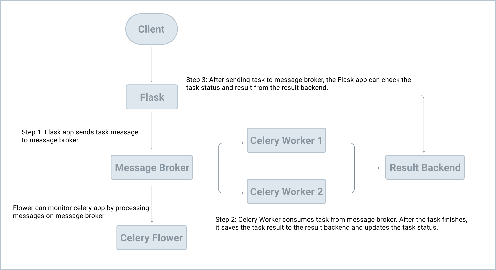

# Basic Celery + Flask + Flower Integration Guide

## Description

This guide outlines the steps to integrate Celery with a Flask application and monitor tasks using Flower. It covers the setup for development environments, including starting a Redis server, initializing a Flask application, setting up Celery, and using Flower for monitoring.

## Deployment

Create and activate a virtual environment:

    py -3 -m venv .venv

    .venv\Scripts\activate

Install Flask and all required dependencies:

    pip install -r requirements

Run the Flask app with debugging turned on (for autoreload upon changes):

    flask --app src/app --debug run

You can now view your app at: http://127.0.0.1:5000/

## Setup

### Initialize Flask App 

Set up the Flask application environment variables and start the Flask application using the following commands:

**For Windows**

    $env:FLASK_APP = "src/app.py"

    $env:FLASK_ENV = "development"

**For Unix/Linux**

    export FLASK_APP=src/app.py

    export FLASK_ENV=development

Note: you can now run `flask run` or `flask run --debug` instead of flask --app src/app run --debug

### Test Redis Server

Ensure that the Redis server is running

    redis-cli ping

If you do not receive a "PONG" response, start the Redis server

    redis-server

### Open Three Terminals

**Terminal #1: Start Celery**

Navigate to the src directory to start the Celery worker

    cd src

    celery -A app.celery worker --pool=solo --loglevel=info -f logs/celery.log

**Terminal #2: Start Flask**

Start the Flask shell environment

    flask shell

**Terminal #3: Monitor Celery with Flower**

To monitor Celery tasks and workers, start Flower in a new terminal

    celery -A app.celery flower --port=5555

Navigate to [http://localhost:5555](http://localhost:5555) to view the dashboard.

### Send a Task to Celery 

Send tasks to Celery in Terminal #2 (Flask)

    from app import divide

    task = divide.delay(1, 2)

    type(task)

    print(task.state, task.result)

To monitor the status of a task, use its AsyncResult ID from the Flower dashboard UUID column

    from celery.result import AsyncResult

    task = AsyncResult(<<AsyncResult ID>>)

    task.state

    task.result

### Refs

[x] https://testdriven.io/courses/flask-celery/getting-started/

[ ] https://flask.palletsprojects.com/en/3.0.x/patterns/celery/#integrate-celery-with-flask